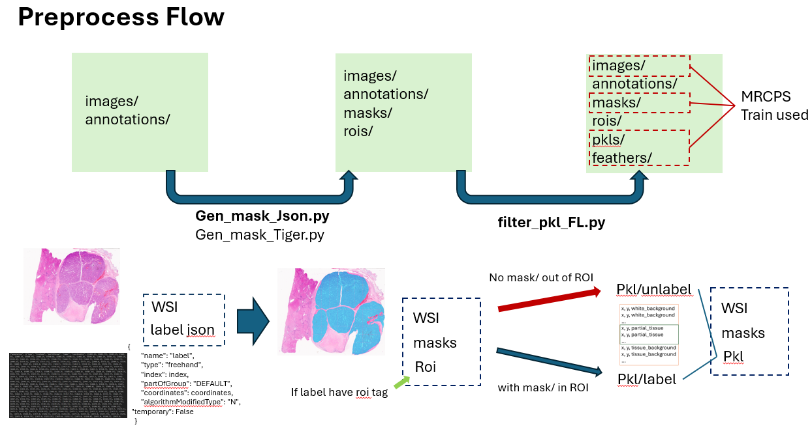

# FLAg_preprocess
Before start fl on FLAg need to prepare data for training.
Each task shoud prepare personal data format.
The annotation is based on ALOVAS.

## Workflow
### MRCPS - pkl/feather prepare process



#### Requirements
```
tqdm                        4.67.1
pyvips                      2.2.3
numpy                       1.24.4
opencv-python               4.10.0.84
opencv-python-headless      4.10.0.84
pandas                      2.0.3
```

#### how to use
gen mask and roi from image and annotation (need prepare images and annotations)
```
python Gen_Mask_json.py
```
```
python Gen_Mask_json.py --slide_path ./dataset/images/  --json_path ./dataset/annotations/ --save_path ./dataset/
```

gen pkl from image, mask and roi  
```
python filtering_to_pkl_FL.py
```
```
python filtering_to_pkl_FL.py --tifroot ./dataset/images/ --maskroot ./dataset/masks/ --roiroot ./dataset/rois/ --saveroot ./dataset/pkl/
```

gen datalist from pkl info
```
python Gen_datalist.py 
```
```
python Gen_datalist.py --pklroot_label ./dataset/pkl/MRCPS_p512_s384_label_level0/ --pklroot_unlabel ./dataset/pkl/MRCPS_p512_s512_unlabel_level0/ --saveroot ./dataset/
```
